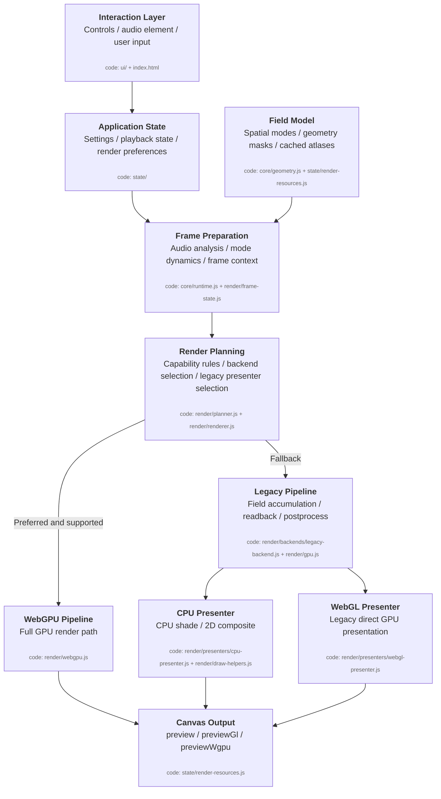

```mermaid
flowchart TB
  UI["<b>Interaction Layer</b><br/>Controls / audio element / user input<br/><br/><span style='font-size:11px;color:#666'>code: ui/ + index.html</span>"]

  APP["<b>Application State</b><br/>Settings / playback state / render preferences<br/><br/><span style='font-size:11px;color:#666'>code: state/</span>"]

  FIELD["<b>Field Model</b><br/>Spatial modes / geometry masks / cached atlases<br/><br/><span style='font-size:11px;color:#666'>code: core/geometry.js + state/render-resources.js</span>"]

  FRAME["<b>Frame Preparation</b><br/>Audio analysis / mode dynamics / frame context<br/><br/><span style='font-size:11px;color:#666'>code: core/runtime.js + render/frame-state.js</span>"]

  PLAN["<b>Render Planning</b><br/>Capability rules / backend selection / legacy presenter selection<br/><br/><span style='font-size:11px;color:#666'>code: render/planner.js + render/renderer.js</span>"]

  WGPU["<b>WebGPU Pipeline</b><br/>Full GPU render path<br/><br/><span style='font-size:11px;color:#666'>code: render/webgpu.js</span>"]

  LEGACY["<b>Legacy Pipeline</b><br/>Field accumulation / readback / postprocess<br/><br/><span style='font-size:11px;color:#666'>code: render/backends/legacy-backend.js + render/gpu.js</span>"]

  CPU["<b>CPU Presenter</b><br/>CPU shade / 2D composite<br/><br/><span style='font-size:11px;color:#666'>code: render/presenters/cpu-presenter.js + render/draw-helpers.js</span>"]

  WEBGL["<b>WebGL Presenter</b><br/>Legacy direct GPU presentation<br/><br/><span style='font-size:11px;color:#666'>code: render/presenters/webgl-presenter.js</span>"]

  OUT["<b>Canvas Output</b><br/>preview / previewGl / previewWgpu<br/><br/><span style='font-size:11px;color:#666'>code: state/render-resources.js</span>"]

  UI --> APP
  APP --> FRAME
  FIELD --> FRAME
  FRAME --> PLAN

  PLAN -->|Preferred and supported| WGPU
  PLAN -->|Fallback| LEGACY

  LEGACY --> CPU
  LEGACY --> WEBGL

  WGPU --> OUT
  CPU --> OUT
  WEBGL --> OUT
```