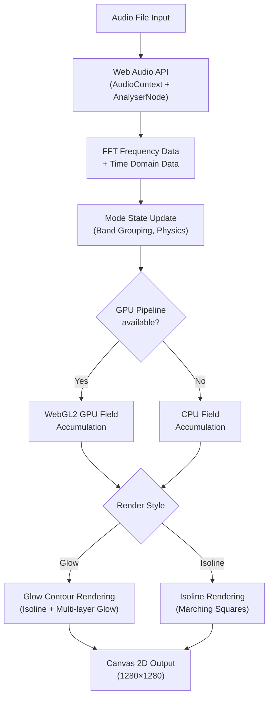
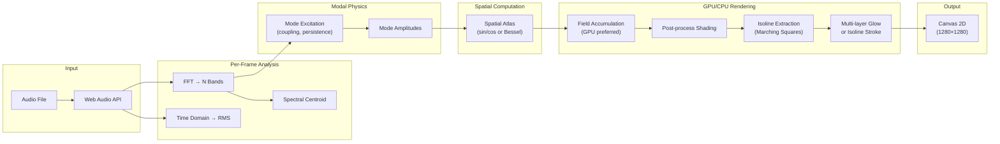

# Web 模块实现分析

> [!NOTE]
> 该模块是一个纯前端的 **音频驱动共振场实时预览器**（Realtime Resonance Field Preview），无需后端，直接在浏览器中完成音频分析和可视化渲染。

---

## 1. 文件组成

| 文件 | 大小 | 职责 |
|------|------|------|
| [index.html](file:///Users/ppp/repos/seesound/audio-reactive-video/web/index.html) | 9.6 KB | 页面结构、控制面板、Canvas 画布 |
| [app.js](file:///Users/ppp/repos/seesound/audio-reactive-video/web/app.js) | 79 KB / 2220 行 | 全部业务逻辑（音频、物理、GPU 管线、渲染） |
| [app.css](file:///Users/ppp/repos/seesound/audio-reactive-video/web/app.css) | 4.4 KB | 暗色玻璃态 UI 样式 |

---

## 2. 整体架构



---

## 3. 核心子系统详解

### 3.1 音频分析子系统

- **入口**: [ensureAudioGraph()](file:///Users/ppp/repos/seesound/audio-reactive-video/web/app.js#L1522-L1538)
- 使用 `AudioContext` + `AnalyserNode`（FFT size = 2048, smoothing = 0.78）
- 通过 `MediaElementSource` 连接 `<audio>` 元素
- 每帧提取：
  - **频率数据** (`getByteFrequencyData`) → 对数分组为 N 个频带
  - **时域数据** (`getByteTimeDomainData`) → 计算 RMS
  - **频谱质心** (spectral centroid) → 用于颜色/动态控制

**频带分组** ([groupBands](file:///Users/ppp/repos/seesound/audio-reactive-video/web/app.js#L1581-L1596))：
- 使用对数 (`Math.pow`) 分组将 FFT bins 映射到 N 个组（等 Mel 间距）
- 支持 2-48 个模态频带

### 3.2 物理模态系统

> [!IMPORTANT]
> 系统模拟 **Chladni 板振动模态**——方板用正弦叠加，圆板用贝塞尔函数。

#### 方板模态 ([buildSquareModes](file:///Users/ppp/repos/seesound/audio-reactive-video/web/app.js#L986-L1011))
- 空间分布公式：`cos(nπx)cos(mπy) - cos(mπx)cos(nπy)`
- 排除 `m == n` 的退化情况
- 按 `m+n` 的升序排列，覆盖 order 2~16

#### 圆板模态 ([buildCircleModes](file:///Users/ppp/repos/seesound/audio-reactive-video/web/app.js#L1013-L1042))
- 使用 **贝塞尔函数** `J_n(z_nm · r) · cos(nθ)` ([besselJ](file:///Users/ppp/repos/seesound/audio-reactive-video/web/app.js#L1127-L1135), [circleModeValue](file:///Users/ppp/repos/seesound/audio-reactive-video/web/app.js#L1137-L1148))
- 预存贝塞尔零点表 `BESSEL_ZEROS`（n=0~8, m=1~3）
- 支持角度旋转参数

#### 物理驱动 ([updateModeState](file:///Users/ppp/repos/seesound/audio-reactive-video/web/app.js#L1598-L1650) & [renderField](file:///Users/ppp/repos/seesound/audio-reactive-video/web/app.js#L1679-L1694))

```
每个模态的更新方程：

excitation = bandValue^1.35 × (0.4 + coupling × 1.3)
detune     = sin(phase × f(bandBias) + modePhase) × motion × 0.06
velocity   = velocity × persistence + (excitation - amp) × (0.18 + coupling × 0.1)
amp        = max(0, amp + velocity + detune) × 0.985
```

- **Coupling** 控制音频激励强度
- **Persistence** 控制衰减速度（模拟阻尼）
- **Motion** 控制内部相位漂移（模拟频率微调）

### 3.3 GPU 渲染管线 (WebGL2)

系统实现了两条 WebGL2 GPU 管线：

#### GPU Field Pipeline（场计算）
- [ensureGpuFieldPipeline()](file:///Users/ppp/repos/seesound/audio-reactive-video/web/app.js#L510-L640)
- 使用 **MRT (Multiple Render Targets)** 输出 3 张纹理：
  1. `outField` — 场标量值 (RGBA16F)
  2. `outColorAccum` — 颜色加权累积
  3. `outColorWeight` — 颜色权重
- 输入：
  - `sampler2DArray` **空间图谱** (sharp + blurred 两套，每层一个模态)
  - `sampler2D` **模态状态** (8×48 纹理，pack了 enabled/contribution/mix/color)
- 核心 shader 逻辑：逐像素遍历所有活跃模态，累加 `sharp * sharpMix + blurred * blurMix`

#### GPU Shade Pipeline（着色）
- [ensureGpuShadePipeline()](file:///Users/ppp/repos/seesound/audio-reactive-video/web/app.js#L642-L715)
- 对场结果做**后处理着色**：
  - 计算梯度边缘检测
  - 节点核心/光晕指数衰减
  - 暖色/冷色通道分离
  - 频率着色混合
  - Dither 抗量化
- 目前 `canUseGpuFinalShade = false`，**着色管线存在但未启用**

> [!TIP]
> GPU Field Pipeline 已启用且是默认路径。CPU fallback 仅在 WebGL2 不可用时使用。系统还实现了 GPU/CPU 的[周期性交叉验证](file:///Users/ppp/repos/seesound/audio-reactive-video/web/app.js#L807-L844)（每 120 帧比较一次 maxAbsDiff / meanAbsDiff），确保 GPU 计算准确。

### 3.4 渲染输出

#### Glow 模式（默认）
1. 场图低透明度叠加 → 柔和底色
2. **Isoline 提取** ([buildIsolinePath](file:///Users/ppp/repos/seesound/audio-reactive-video/web/app.js#L1385-L1431))：Marching Squares 提取零等值线
3. **多层辉光** ([drawGlowContours](file:///Users/ppp/repos/seesound/audio-reactive-video/web/app.js#L1465-L1520))：
   - 外层辉光（大模糊 + 低透明度）
   - 内层辉光（小模糊 + 中透明度）
   - 核心线条（无模糊 + 高透明度）
4. 通过离屏 `glowCanvas`（2048×2048）渲染后合成

#### Isoline 模式
- 仅渲染零等值线，带阴影和半透明

#### 共用后处理
- 大气背景渐变（可关闭）
- 圆板边缘柔化环
- 方板边框线

### 3.5 颜色与主题系统

| 主题 | 特色 |
|------|------|
| Lab Green | 科学绿调 |
| Amber Mist | 琥珀暖调 |
| Ice Cyan | 冰蓝冷调 |
| Heatmap | 红橙暖光谱 |
| Monochrome | 灰绿单色 |
| Custom | 用户自选 low/mid/high 三色 |

颜色映射逻辑 ([getModeBaseColor](file:///Users/ppp/repos/seesound/audio-reactive-video/web/app.js#L1265-L1295))：
- 基于频带中心频率的 **Mel 刻度** 映射到 low→mid→high 三色渐变
- `adaptiveColorMix` 混合固定映射与自适应（基于能量分布 CDF）映射
- `colorSeparation` 控制颜色极化程度

---

## 4. 控制参数总览

### Display 组

| 参数 | 范围 | 说明 |
|------|------|------|
| Plate shape | Square / Circle | 方板/圆板模态切换 |
| Angular rotation | 0-360° | 圆板专用，旋转角节点 |
| Render style | Glow / Isoline | 辉光渲染 vs 等值线渲染 |
| Atmosphere | on/off | 背景径向渐变 |
| Glow thickness | 0.2-10 | 线条粗细 |
| Glow spread | 0.1-10 | 辉光衰减半径 |
| Color separation | 0-4 | 频率色散强度 |
| Adaptive color mix | 0-1 | 固定/自适应颜色混合 |
| Theme | 6 预设 | 频率调色板 |
| Display mode | Combined / Single | 叠加场 / 单模态 |
| Combine mode | Signed / Residual / Percentile | 叠加方式 |
| Nodal focus | 0.1-8 | 零线锐度 |
| Field contrast | 0.2-6 | 背景场衰减曲线 |

### Synthesis 组

| 参数 | 范围 | 说明 |
|------|------|------|
| Mode count | 2-48 | 活跃模态数 |
| Coupling | 0-4 | 音频→模态驱动强度 |
| Persistence | 0-0.999 | 模态阻尼/持续 |
| Motion | 0-4 | 相位漂移与微调活动度 |

---

## 5. 性能优化策略

| 策略 | 实现 |
|------|------|
| **GPU 场累加** | 所有模态在 WebGL2 fragment shader 中一次遍历完成 |
| **空间图谱缓存** | `spatialAtlasCache` + `spatialCache` 避免重复计算正弦/贝塞尔场 |
| **GPU 纹理图谱** | 使用 `TEXTURE_2D_ARRAY` 存储所有模态的空间数据 |
| **频带分组缓存** | `bandRangeCache` 按 `groups:sampleRate` 缓存 |
| **等值线路径缓存** | `contourPathCache` 按参数指纹缓存 Path2D |
| **离屏辉光合成** | 单独 2048×2048 canvas 预渲染辉光，一次合成 |
| **模态状态压缩** | 8×48 纹理打包 enabled/contribution/mix/color |
| **requestAnimationFrame** | 播放时连续循环，暂停时按需单帧 |

---

## 6. 数据流 Summary



---

## 7. 亮点与注意事项

> [!TIP]
> **亮点**
> - 完全无后端依赖，纯浏览器内完成 FFT → 物理模拟 → GPU 渲染的完整管线
> - GPU/CPU 双路径 + 交叉验证，兼顾性能与兼容性
> - 物理模型基于真实的 Chladni 板数学（方板正弦组合 + 圆板贝塞尔函数）
> - 丰富的参数化控制（20+ 滑块/选择器），可实时调节所有视觉与物理参数

> [!WARNING]
> **注意事项**
> - [app.js](file:///Users/ppp/repos/seesound/audio-reactive-video/web/app.js) 是一个 2220 行的单文件，没有模块化拆分
> - GPU Shade Pipeline 已实现但被硬编码禁用 (`canUseGpuFinalShade = false`)
> - 贝塞尔函数用 20 项级数展开实现，对大参数可能精度不足
> - 圆板模态只覆盖 angular order 0~8 × radial order 1~3（共 27 种模态对）
> - `fieldSize` 固定 384×384，不可配置
